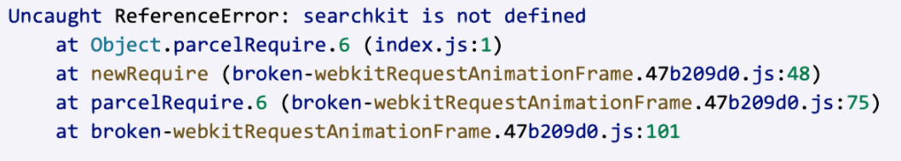

*Question 1*  

 
From: marissa@startup.com  
Subject:  Bad design  

Hello,  
  
Sorry to give you the kind of feedback that I know you do not want to hear, but I really hate the new dashboard design. Clearing and deleting indexes are now several clicks away. I am needing to use these features while iterating, so this is inconvenient.  
   
Thanks,  
Marissa  

  
--

*Question 2*:   
  
From: carrie@coffee.com  
Subject: URGENT ISSUE WITH PRODUCTION!!!!  
  
Since today 9:15am we have been seeing a lot of errors on our website. Multiple users have reported that they were unable to publish their feedbacks and that an alert box with "Record is too big, please contact enterprise@algolia.com".  
  
Our website is an imdb like website where users can post reviews of coffee shops online. Along with that we enrich every record with a lot of metadata that is not for search. I am already a paying customer of your service, what else do you need to make your search work?  
  
Please advise on how to fix this. Thanks.   

  
--

*Question 3*:   

From: marc@hotmail.com  
Subject: Error on website  
  
Hi, my website is not working and here's the error:  
  
  
  
Can you fix it please?  

